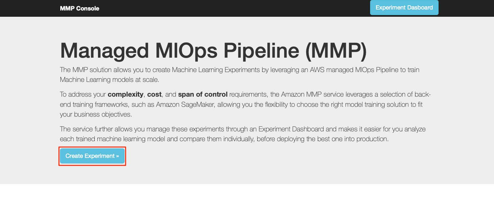
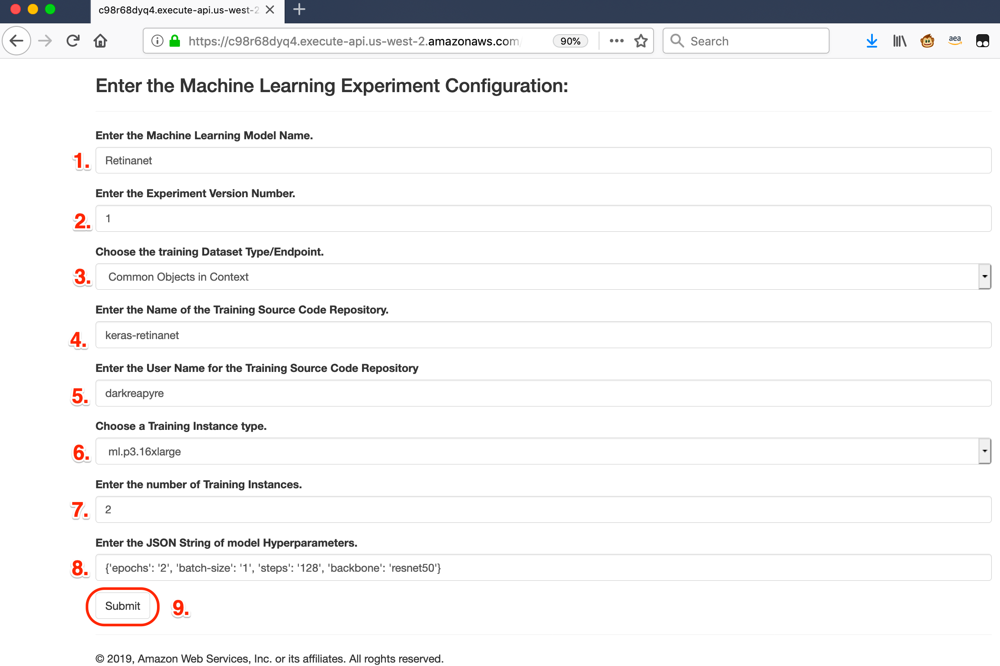
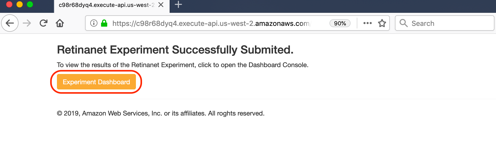

# Scalable Machine Learning Experiments using a Managed MlOps Pipeline (MMP) and mlflow

## Overview

The MMP solution allows you to create Machine Learning Experiments by leveraging an AWS managed MlOps Pipeline to train Machine Learning models at scale. To address your **complexity**, **cost**, and **span of control** requirements, the solution leverages a selection of back-end training frameworks, such as Amazon SageMaker, allowing you the flexibility to choose the right model training solution to fit your business objectives. The service further allows you manage these experiments through an Experiment Dashboard and makes it easier for you analyze each trained machine learning model and compare them individually, before deploying the best one into production.

## Requirements

### General Requirements
1. AWS Account.
2. Necessary Limits for GPU/CPU training instances in the appropriate AWS Region.
3. AWS CLI installed and configured.

>__Note:__ This solution has only been tested in the *us-west-2* AWS Region.

### Training Requirements

The following list of requirements need to be implemented in the model training code before it can be leveraged by the MlOps Pipeline.
1. Fully configured and Horovod-optimized model **must** be called `train.py` and copied to the "root" of the source GitHub or CodeCommit repository.
2. Should any code from the GitHub/CodeCommit repository be installed, the repository must include a `setup.py` or a `requirements.txt`. The Horovod container includes commands to install these.
3. Make sure to import the Horovod library in the `train.py` script, for example:
    ```python
    import horovod
    ```
4. The `train.py` file **must** leverage Python `argparse()` functionality and must include the following mandatory parameters:
    - `--output-path`: This will automatically point to the "local" path where any model training checkpoints (i.e. if using `keras.callbacks.ModelCheckpoint()`) are stored. If SageMaker is leveraged as the training platform, this path will automatically point to the SageMaker output path and will store the fully strained (or check-pointed model) to Amazon S3.
    - `--dataset-path`: If using SageMaker as the training platform, this will automatically point to the local copy of the training/validation datasets copied from S3 during training instance deployment. Alternatively, if either the Deep Learning AMI or Kubernetes are used as the training platform, this will point to the FSx mount point.
    - `--dataset`: This is the name of the training/validation dataset that is populated from the experiment configuration's list of supported datasets.
    - `--experiment-name`: This is the name of the experiment from the experiment configuration and is used to update the active run parameters of the experiment platform.
    - `--tracking-uri`: This is the experiment platform tracking endpoint URL.
    - For example:
        ```python
        # MlOps/Horovod Framework specific command line parameters
        parser.add_argument('--dataset-path', help='Path to the training dataset.', dest='dataset_path', type=str)
        parser.add_argument('--output-path', help='Path to the trained model output.', dest='output_path', type=str)
        parser.add_argument('--tracking-uri', help='MlFlow Tracking API URL.', dest='tracking_uri', type=str)
        parser.add_argument('--experiment-name', help='MlFlow Experiment Name.', dest='experiment_name', type=str)
        parser.add_argument('--dataset', help='Training dataset Name.', dest='dataset_type')
        ```
5. All command line parameters Hyper-parameters, that will be executed by the `train.py` script must be configured in the `experiment_config.json` configuration file as a **JSON string** for example:
    ```json
    "Hyperparameters": "{'epochs': '40', 'batch_size': '32'}"
    ```
6. If any "local" directories need to be created, for example the `snapshot_path`, the directories need to be created within the `train.py` script.

### Experiment Requirements

The following is a list of requirements that need to be implemented within he model training code in order for training updates to be sent to the MlFlow tracking URI.
1. Make sure to import the `mlflow`, as well as the libraries for the specific framework (i.e. keras) intro the `train.py` script, for example:
    ```python
    import mlflow
    import mlflow.keras
    ```
2. The `train.py` file must create an MlFlow experiment and configure the following parameters:
    - `tracking_uri`
    - `experiment_id`
3. After the training (model fit) has occurred, make sure to upload the Hyper-parameters and the metrics.
4. Ensure that all of the tracking updates occur on the primary Horovod hosts, `hvd.rank == 0`.
5. For example:
    ```python
    if hvd.rank() == 0:
    mlflow.tracking.set_tracking_uri(args.tracking_uri)
    experiment_id = mlflow.create_experiment(args.experiment_name)
    with mlflow.start_run(experiment_id=experiment_id) as run:
        mlflow.log_param('epochs', args.epochs)
        mlflow.log_param('batch_size', args.batch_size)
        mlflow.log_param('momentum', args.momentum)
        mlflow.log_param('weight_decay', args.wd)
        mlflow.log_param('learning_rate', args.base_lr)
        mlflow.log_metric('loss', score[0])
        mlflow.log_metric('accuracy', score[1])
        mlflow.log_artifacts(args.output_path, 'output')
    ```
>__Note:__ For further examples of how to configure these parameters, please see the **master** branch.

## Deployment

1. A pre-packaged script has been provided to automatically deploy the solution into AWS. To execute this script, run the following command:
    ```bash
    bin/deploy
    ```
2. When prompted, enter the following:
    - The AWS Region you wish to deploy the solution in.
    - The name of the solution deployment. (__Note:__ This must be lower case!)
    - An e-mail address to send training updates.
3. The `deploy` script will perform the following:
    - Create a "bootstrap" bucket on S3 to store the artifacts (i.e. CloudFormation templates, Lambda Source etc.).
    - Package and upload the _Front-End_ artifacts to S3.
    - Package and upload the _Experiment Management_ platform (MlFlow) artifacts to S3.
    - Package and upload the _MlOps Pipeline_ artifacts for each supported training platform (i.e. SageMaker, Kubernetes, Deep Learning AMI) to S3.
    - Package and upload the _Launch Configuration_ artifacts (i.e. Lambda function to trigger the pipeline) to S3.
    - Create the master CloudFormation Stack that will deploy the various nested stacks for each component of the solution.
4. Once the entire stack has been deployed, wait for around **35 Minutes** for the master build container to complete, then click on the **Outputs** tab in the **CloudFormation Console**. Click on the __FrontEndURL__ link to open the console.

## Running the Machine Learning Experiment

1. To create a Machine Learning Experiment, open the URL for the front-end or Console interface. This URL link can be found by looking at the `FrontEndURL` key in the **Outputs** tab of the CloudFormation stack.
2. From the console interface, select the desired experiment training platform by clicking the **Create Experiment** button for that platform, as shown below:  

>**Note:** Currently, only the *SageMaker* platform is supported.
3. Enter the desired configuration, specific to the experiment as follows:
    1. __Machine Learning Model Name:__ Provide a name for the experiment by specifying the name of the model being trained.
    2. __Experiment Version:__ Specify a *unique* version number for the specified experiment.
    3. __Dataset Type:__ Select the required training dataset from the list provided.
    4. __Model Source Code:__ Provide the name of the GitHub Repository where the model source code is located. This is the name of the repository where the `train.py` file is located.
    5. __Repository User Name:__ Enter the name of the GitHub user name that has the model source code repository.
    6. __Training Instance Type:__ Using the drop-down list, select the type of CPU or GPU training instance required to run the experiment.
    7. __Training Instance Count:__ Enter the number of CPU or GPU instances to be used to run the experiment.
    8. __Training Hyper-parameters:__ Enter the experiment specific Hyper-parameters in the form of a JSON string.
    9. Submit the experiment for training by clicking on the **Submit** button.  

4. Once the experiment is complete, click on the **Experiment Dashboard** button to open the MlFlow experiment tracking dashboard:
